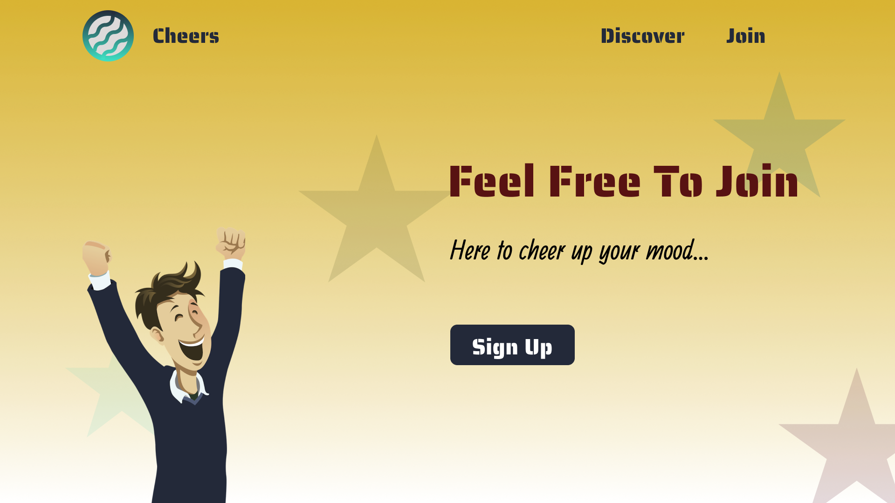

# cheers
### A Community Building Website model

> Sample Landing Page 



## Using tools

- HTML
- CSS

## Features

1. User Friendly
2. Article View
3. Column Section Divided
4. Responsive 
5. Simple and Easy

> HTML SAMPLE

```HTML
    <section class="home-main-section">
      <div class="image-wrapper">
        <div class="cheer-image"></div>
      </div>
      <div class="call-to-action">
        <h1 class="title">Feel Free To Join</h1>
        <span class="subtitle">Here to cheer up your mood...</span>
        <a href="join.html" class="btn">Sign Up</a>
      </div>
```

> CSS SAMPLE

```CSS
.home-main-section .call-to-action{
    display: flex;
    flex-direction: column;
    align-items: flex-start;
    margin: 1rem;
    align-self: center;
}

@media(max-width:900px){
    .home-main-section .image-wrapper{
        display: none;
    }
    .home-main-section{
        justify-content: center;
    }
}
```

> Contact With Developer:

### Saikat Roy

> Email: njmsaikat@gmail.com

> Personal Portfolio: https://njmsaikat.github.io/saikat/

> Linked In Profile: https://www.linkedin.com/in/njmsaikat/

